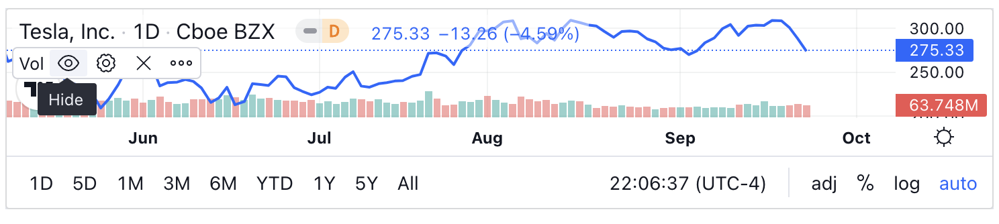

# stock-market-chart

A React UI component to render realtime trading chart by [ticker symbols](https://stockanalysis.com/stocks/).

## Installation

```sh
npm install stock-market-chart
```

## Usage

Simply use the component as below in your client side code.

Example file: <mycomponent.js>

```js
import React from 'react';
import { StockMarketChart } from 'stock-market-chart'

function StockTest() {
    const SYMBOL = 'TSLA';

    return <StockMarketChart tickerSymbol={SYMBOL} />
}

export default StockTest;
```

### Example




## Maintainers

- [Kalyan Teja Tatineni](https://github.com/kalyanteja)

#### Resource

- Chart powered by TradingView